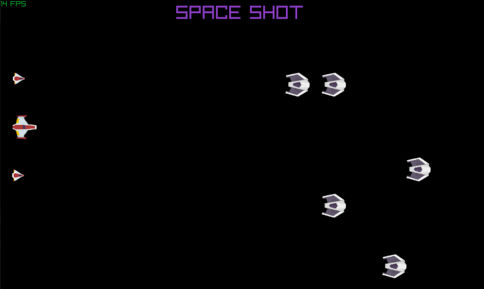
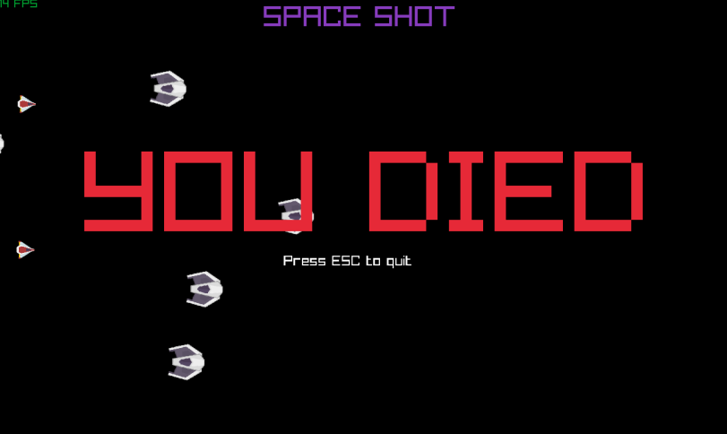

| Nicholas Jordan|
| :---          	|
| s208047     	|
| MathForGames |
| Space Shot Documentation |

## I. Requirements
**1. Completed Redistributable Maths Classes**

    - Submitted redistributable static library that implements:
       -Vector classes for 3D vectors, including homogeneous 3D vectors
            -Classes implement methods for, in all instances, translation, scale, magnitude, normalisation, cross product and dot product
       -Matrix classes for 3D matrices, including homogeneous 4D matrices
            -Classes implement methods for multiplication, vectors transformation, and transpose
            -Classes implement methods for setting up as rotation matrices
       -As part of the Colour class, functions for manipulating a bitfield implemented using bit shift operations
    - Code suitably commented to an industry standard as specified by your teacher

**2. Unit Test Results**

    - Math classes successfully pass the Unit Test provided by instructor

**3. Test Application**

    - Submitted executable for Graphical Test Application That makes use of your maths classes to implement the following
        -Example of matrix hierarchy to manipulate visible element
        -Example of game objects moving using velocity and acceleration with vectors
        -Example of simple collision detection

**4. Peer Review Session**

    -participation in peer review sessions
    -Documented outcomes of peer review sessions

**5. Number Coversion Exercises**

    -Completed Number Conversion Exercises

**6. Application Handover**

    -A visual Studio solution and project that compiles withour errors
        -All temporary and built executable files in the obj and bin folder have been removed
    -A "readme" or client document explaining how yo compile, run and operate the program
    -All submitted material archived in a single compressed file

## II. Design

The game consist of the main spaceship that is the player and then two little space ships on either side. 
Then enemies randomly spawn and come towards the player from the other side.

Since the point of the project is to show Parent/ Child relations, I have the two baby ships acting as children to the player ship.

Another required field for the assesment was collision detection, 
which can be seen when the enemy ships collide with the children or the player. 
Collision of with the player causes game over and you died to appear on the screen.

### Object Information

**File**: Game.cs

**Attributes**

        Name: Item 
            Description: Initializes variables
            Type: struct